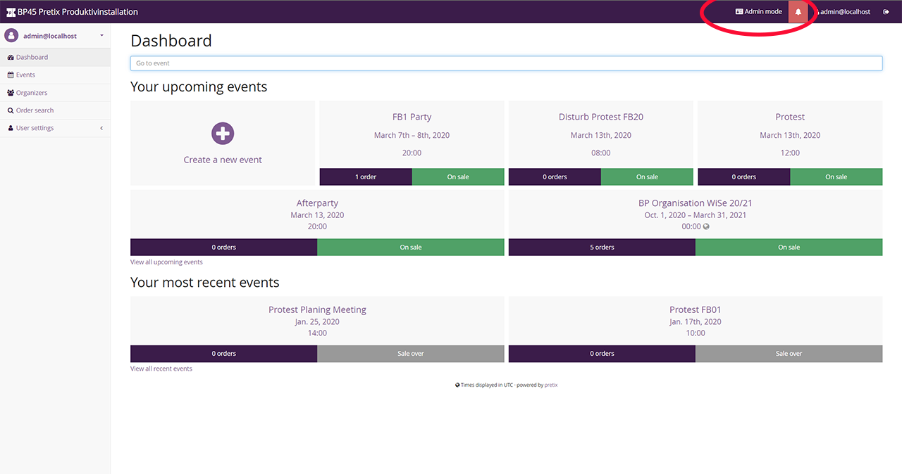
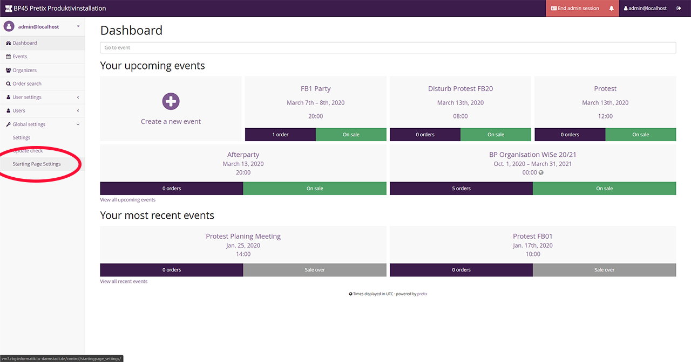
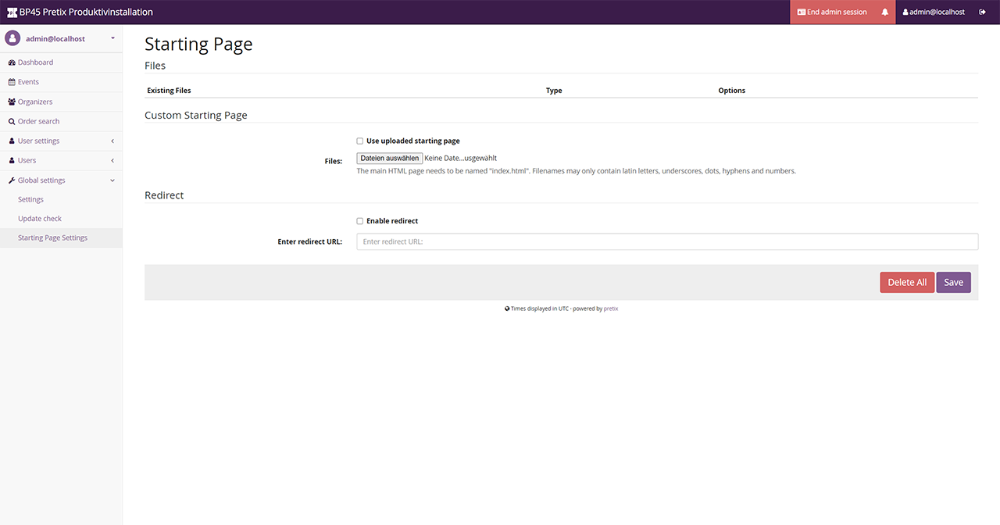
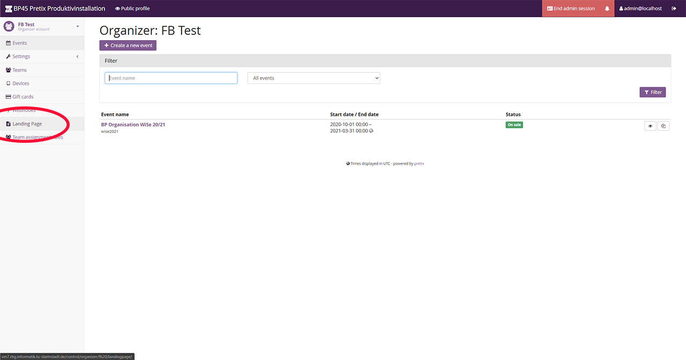
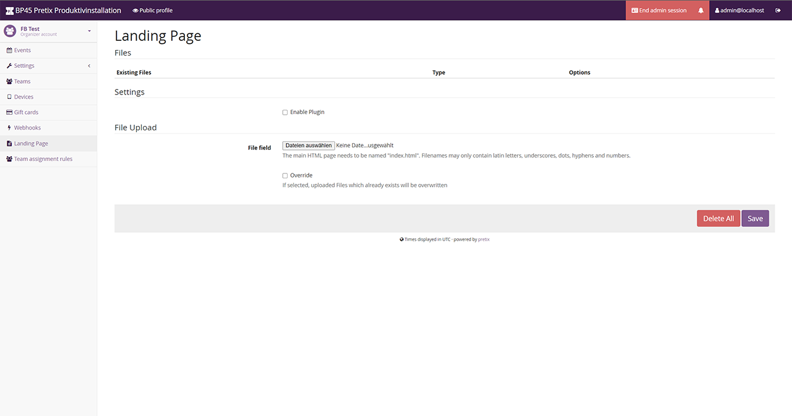
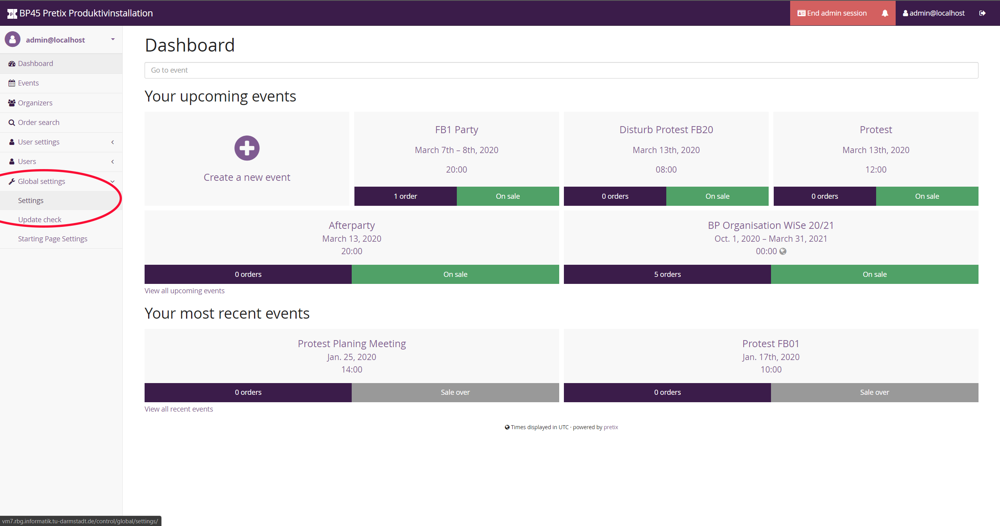
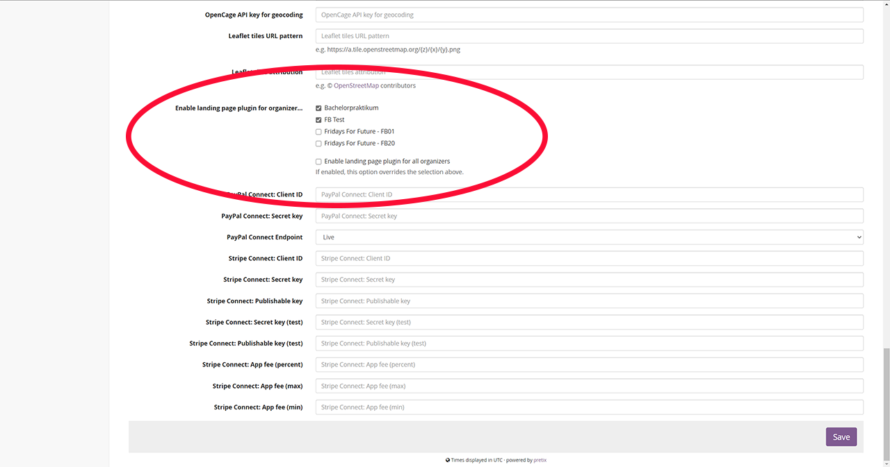

# Everything you need to know


This plugin allows you to upload custom pages using the [Django template language](https://docs.djangoproject.com/en/3.0/ref/templates/language/) (and extra files like stylesheets etc.) for the Pretix starting page or individual organizer pages.

Getting started in Pretix [Pretix Userguide](https://docs.pretix.eu/en/latest/user/index.html)
___
## Table of contents
* [1. Usage](#1-usage)
    + [1.1. Roles and Rights](#11-roles-and-rights)
    + [1.2. Starting Page](#12-starting-page)
    + [1.3. Landing Page for Organizers](#13-landing-page-for-organizers)
    + [1.4. Additional Files](#14-additional-files)
    + [1.5. Event List for Organizer](#15-event-list-for-organizer)
    + [1.6. Calendar for Organizer](#16-calendar-for-organizer)
* [2. Administration](#2-administration)
    + [2.1. Installation](#21-installation)
    + [2.2. Plugin Activation](#22-plugin-activation)
* [3. Development Setup](#3-development-setup)
* [4. Terminology](#4-terminology)

## 1. Usage

### 1.1. Roles and Rights
Pretix offers different roles with different corresponding rights, the relevant roles for this plugin are listed below.

    User
The basic role for logged in accounts. Cannot change any settings.

    Organizer
Can change organisation specific settings like Landingpage-Settings or Team Assignment Rules.

    Admin with enabled Admin mode
Can change global settings for the pretix instance like the startingpage settings or he can enable the landingpage plugin for a certain organisation. To access these functionalities you have to be in Admin mode, which is only accessable for admins.

How to enable the admin mode :




### 1.2. Starting Page
The following options are available for the starting page:
* Upload and set up a custom starting page (named `index.html`)
* Upload and use additional files in the `index.html`
* Set up a redirect to another website

You need to be **logged in as an admin** and have the **admin mode** activated.


To configure the starting page go to the corresponding settings page in the **global settings** dropdown menu.



You will land on the following page, where you can then configure said things.



For the HTML you can use the load_path tag to embed [additional files](#1.4.-Additional-Files)


_Note:
It is not possible to activate the custom starting page and a redirect at the same time._ 


### 1.3. Landing Page for Organizers
To upload an organizer specific landingpage, go to your organizer's control page.  
Then select the navigation item `Landingpage`.   
You can now upload your `index.html` and additional files. To make your custom landingpage visible select the `Use custom landing page` button.



You will land on the following page.




Example for a landingpage:  
```


<html>
<head>  

<link rel="stylesheet" type="text/css" href=>

</head>


    





<body> 

    

</body>

</html>
```
### 1.4. Additional Files
You can use the [template tag](https://docs.djangoproject.com/en/3.0/ref/templates/language/#tags) `load_path` to get the path of any of your additional uploaded files (except `index.html`).
Remember to put `` at the start of your HTML to load the template tag. This template tag loads the path to user uploaded files, so you only have to know the filename.
If the path loading failes, e.g. because of a missing file, the file will not be available for the website it should be embedded in, but everything else will work fine.

Example for usage of load path:  
```


<html>

<body> 

    

</body>

</html>
```

_Note: You can only reference uploads of your current organizer or the starting page respectively._  

### 1.5. Event List for Organizer
To include upcoming events as a table in your custom landing page, simply add
`` at the desired place.  
Alternatively, you can put `previous_events` instead of `upcoming_events` to display events that have already finished.  

```
<html>

    Your Html Code




</html>
```

_Note: If you are not using the default Pretix style, you might want to add table-styling._

### 1.6. Calendar for Organizer

To include a calendar that includes your events as objects, simply add 
`` at the desired place.
We recommend that if you want to use this, make your `html` extend the pretix-default template,
as styling is not straight forward:

```djangotemplate


 
    Some fancy page title 



    

```
     

## 2. Administration

### 2.1. Installation
Please reference the corresponding Pretix documentation for [small-scale manual deployment](https://docs.pretix.eu/en/latest/admin/installation/manual_smallscale.html#install-a-plugin) or [small-scale deployment with docker](https://docs.pretix.eu/en/latest/admin/installation/docker_smallscale.html#install-a-plugin).  
There is an example Dockerfile provided in this project's repository.

[//]: <> (TODO)

### 2.2. Plugin Activation
This plugin is enabled by default. 
Admins can, however, enable this plugin individually for each organizer.
To do so


1. Enable the **admin mode** and go to the **global settings**.  



2. Select the organizers you want to allow to use the plugin.



There is also an option to enable the plugin for all organizers. (default)  
**If an organizer is not selected he is not allowed to use the plugins functionalities.**   


_Note: Only enable this plugin for organizers you trust! 
Uploading custom pages can result in serious security issues as organizers can put anything they want on their page._


## 3. Development Setup
[Pretix](https://docs.pretix.eu/en/latest/development/setup.html) needs to be installed.  
Clone this repository to any directory on your system.  
1. activate your local pretix environment.  
1. cd into pretix-landing-pages 
1. run `python setup.py develop` to package the plugin  
1. cd into your pretix source code (`pretix/src`)  
1. run `python manage.py makemigrations pretix_landing_pages` to create the migrations
1. run `python -m pretix migrate` to migrate DB-model changes into pretix-DB  

Once the setup is done, there is no need for actions after changes to the plugin, unless you make changes to the DB model  
=> In this case, you need to rerun step 6. (to 8)

## 4. Terminology

    Landingpage
Site used by the organizer to represent an organization   

    Startingpage
The root page of a pretix instance (can only be changed by the admin in admin mode)

Here are some other [Pretix-Terminology](https://docs.pretix.eu/en/latest/development/concepts.html)


